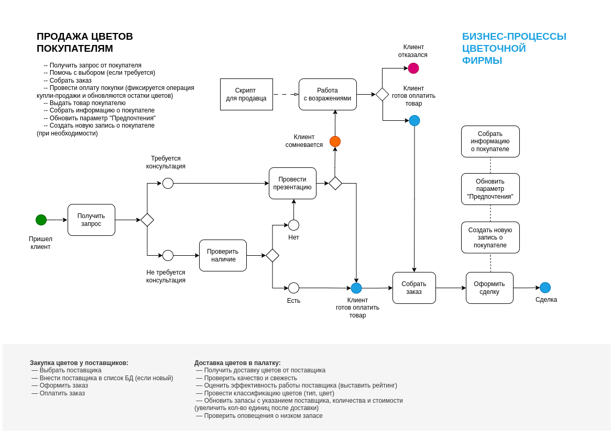
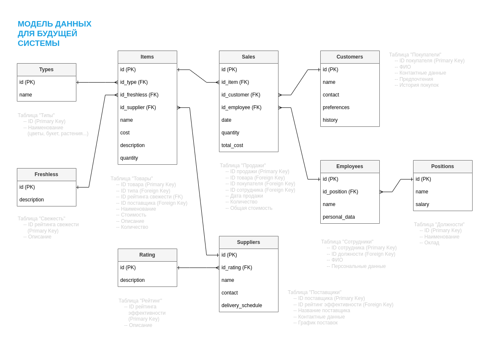

# Система управления цветочным магазином

## Цель проекта
Разработка системы управления для сети цветочных магазинов, направленной на оптимизацию учета товаров, продаж и работы с клиентами.

## Краткое описание бизнес-процессов
Система охватывает следующие ключевые бизнес-процессы:
- Продажа цветов покупателям
- Закупка цветов у поставщиков
- Доставка цветов в палатку
- Учет товаров и продаж
- Работа с клиентской базой

### Диаграмма бизнес-процессов

### Модель данных

## Использованные инструменты
- draw.io (diagrams.net) для создания диаграмм
- GitHub для хранения и версионирования проекта

## Дополнительная информация
Подробное техническое задание можно найти в [документации проекта](docs/technical_requirements.md).